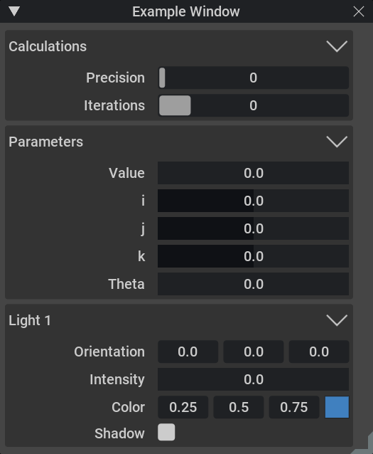
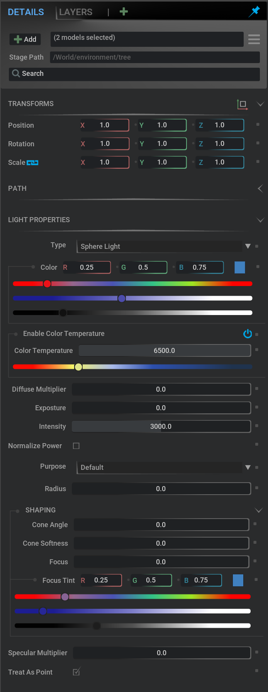

# omni.ui Windows Example

## Generic Window

## Gradient Window

## Julia Modeller

## Adding one of those Extension

To add a those extensions to your Omniverse app:
1. Go into: Extension Manager -> Gear Icon -> Extension Search Path
2. Add this as a search path: `git://github.com/NVIDIA-Omniverse/kit-extension-sample-ui-window?branch=main&dir=exts`

