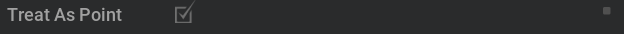
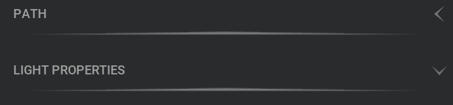

# Gradient Window (omni.example.ui_gradient_window)


# Overview

In this example, we create a window which heavily uses graident style in various widgets. The window is build using `omni.ui`.

It contains the best practices of how to build customized widgets and leverage to reuse them without duplicating the code.

## [Tutorial](../tutorial/tutorial.md)
This extension sample also includes a step-by-step tutorial to accelerate your growth as you learn to build your own
Omniverse Kit extensions. [Get started with the tutorial.](../tutorial/tutorial.md)

# Customized Widgets

A customized widget can be a class or a function. It's not required to derive from anything. We build customized widget so that we can use them just like default `omni.ui` widgets which allows us to reuse the code and saves us from reinventing the wheel again and again. 

## Gradient Image
Gradient images are used a lot in this example. It is used in the customized slider and field background. Therefore, we encapsulate it into a function `build_gradient_image` which is a customized `ui.ImageWithProvider` under the hood. The `ImageWithProvider` has a source data which is generated by `ui.ByteImageProvider`. We define how to generate the byte data into a function called `generate_byte_data`. We use one pixel height data to generate the image data. For users' conveniences, we provide the function signature as an array of hex colors, so we provided a function to achieve `hex_to_color` conversion.

```
def hex_to_color(hex: int) -> tuple:
    # convert Value from int
    red = hex & 255
    green = (hex >> 8) & 255
    blue = (hex >> 16) & 255
    alpha = (hex >> 24) & 255
    rgba_values = [red, green, blue, alpha]
    return rgba_values

def generate_byte_data(colors):
    data = []
    for color in colors:
        data += hex_to_color(color)

    _byte_provider = ui.ByteImageProvider()
    _byte_provider.set_bytes_data(data, [len(colors), 1])
    return _byte_provider

def build_gradient_image(colors, height, style_name):
    byte_provider = generate_byte_data(colors)
    ui.ImageWithProvider(byte_provider,fill_policy=omni.ui.IwpFillPolicy.IWP_STRETCH, height=height, name=style_name)
    return byte_provider
```

With this, the user will be able to generate gradient image easily which also allows flexibly set the height and style. Here are a couple of examples used in the example:

```
colors = cls_color_gradient = [cl("#fa0405"), cl("#95668C"), cl("#4b53B4"), cl("#33C287"), cl("#9fE521"), cl("#ff0200")]
byte_provider = build_gradient_image(colors, 8, "gradient_slider")

cls_button_gradient = [cl("#232323"), cl("#656565")]
button_background_gradient = build_gradient_image(cls_button_gradient, 22, "button_background_gradient")
```


## Value Changed Widget
In this example, almost every attribute has got a widget which indicates whether the value has been changed or not. By default, the widget is a small gray rectangle, while the value has been changed it becomes a bigger blue rectangle. We wrapped this up into a function called `__build_value_changed_widget` and returns both rectangles so that the caller can switch the visiblity of them.

It is not only an indicator of value change, it is also a button. While you click on it when the value has changed, it has the callback to restore the default value for the attribute. Since different attribute has different data model, the restore callbacks are added into different widgets instead of the value change widget itself.

## Gradient Float Slider
Almost all the numeric attribute in this example is using gradient float slider which is defined by `_build_gradient_float_slider`. This customized float slider are consisted of three parts: the label, the float slider, and the value-changed-widget.

The label is just a usual `ui.Label`.

The slider is a normal `ui.FloatSlider` with a gradient image, composed by `ui.ZStack`. 

We also added the `add_value_changed_fn` callback for slider model change to trigger the value-changed-widget change visiblity and `rect_changed.set_mouse_pressed_fn` to add the callback to restore the default value of the silder.

```
rect_changed, rect_default = self.__build_value_changed_widget()
# switch the visibility of the rect_changed and rect_default to indicate value changes
slider.model.add_value_changed_fn(lambda model: _on_value_changed(model, rect_changed, rect_default))
# add call back to click the rect_changed to restore the default value
rect_changed.set_mouse_pressed_fn(lambda x, y, b, m: _restore_default(slider))
```


## Customized CheckBox
The customized Checkbox is defined by `_build_checkbox`. It is also consisted of three parts: the label, the check box, and the value-changed-widget.

The label is just a usual `ui.Label`.

For the check box, since we have completely two different images for the checked and unchecked status. Therefore, we use `ui.Image` as the base for the customized CheckBox. The `name` of the image is used to switch between the corresponding styles which changes the `image_url` for the image. 

The callbacks of value-changed-widget are added similarly as gradient float slider.




## Customized ComboBox
The customized ComboBox is defined by `_build_combobox`. It is also consisted of three parts: the label, the ComnoBox, and the value-changed-widget.

The label is just a usual `ui.Label`. The ComboBox is a normal `ui.ComboBox` with a gradient image, composed by `ui.ZStack`. The callbacks of value-changed-widget are added similarly as gradient float slider.


## Customized CollsableFrame
The customized CollsableFrame is wrapped in `CustomCollsableFrame` class. It is a normal `ui.CollapsableFrame` with a customized header. It is the main widget groups other widgets as a collapsable frame.



## Customized ColorWidget

The customized ColorWidget is wrapped in `ColorWidget` class. 


The RGB values `self.__multifield` is represented by a normal `ui.MultiFloatDragField`, composed with three gradient images of red, green and blue using `ui.ZStack`, as well as the lable and circle dots in between the three values.

The colorpicker is just a normal `ui.ColorWidget`, which shares the same model of `self.__multifield`, so that these two widgets are connected. 

We also added the `add_item_changed_fn` callback for the shared model. When the model item changes, it will trigger the value-changed-widget to switch the visiblity and `rect_changed.set_mouse_pressed_fn` to add the callback to restore the default value for the shared model.

# Style

We kept all the styles of all the widgets in `style.py`. One advantage is that specific style or colors could be reused without duplication. The other advantage is that users don't need to go through the lengthy widgets code to change the styles.

All the styles are recommended to be arranged and named in a self-explanatory way.

# Window

It's handy to derive a custom window from the class `ui.Window`. The UI can be
defined right in __init__, so it's created immediately or it can be defined in
a `set_build_fn` callback and it will be created when the window is visible. The later one is used in this example. 

```
class PropertyWindowExample(ui.Window):
    """The class that represents the window"""

    def __init__(self, title: str, delegate=None, **kwargs):
        self.__label_width = LABEL_WIDTH

        super().__init__(title, **kwargs)

        # Apply the style to all the widgets of this window
        self.frame.style = example_window_style
        # Set the function that is called to build widgets when the window is visible
        self.frame.set_build_fn(self._build_fn)
```
Inside the `self._build_fn`, we use the customized widgets to match the design layout for the window.

# Extension

When the extension starts up, we register a new menu item that controls the window and shows the window.

A very important part is using `ui.Workspace.set_show_window_fn` to register the window in `omni.ui`. It will help to save and load the layout of Kit.

```
ui.Workspace.set_show_window_fn(ExampleWindowExtension.WINDOW_NAME, partial(self.show_window, None))
```

When the extension shuts down, we remove the menu item and deregister the window callback.