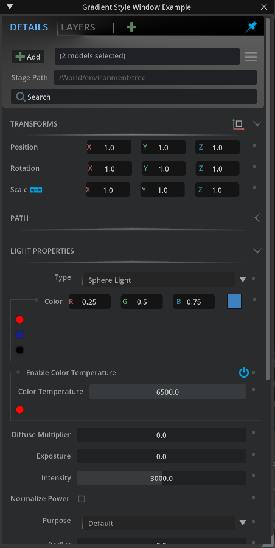
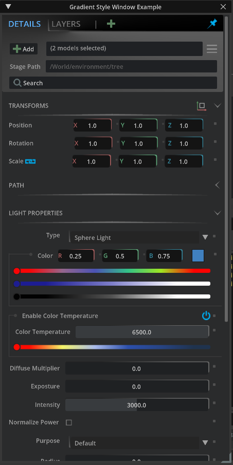
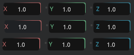
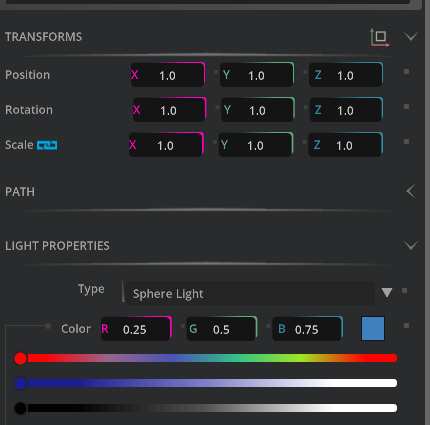
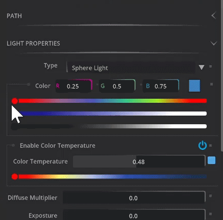
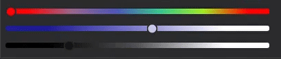

# Gradient Style Window Tutorial

In this tutorial we will cover how we can create a gradient style that will be used in various widgets. This tutorial will mostly cover how to create a gradient image / style that can be applied to your UI Window. 

# Learning Objects
- How to use `ImageWithProvider` to create Image Widgets
- Create functions to interpolate between colors
- Apply custom styles to widgets

# Prereqs.
- [UI Window Tutorial](https://github.com/NVIDIA-Omniverse/kit-extension-sample-ui-window/blob/Tutorial/exts/omni.example.ui_window/tutorial/tutorial.md)
- Omniverse Code version 2022.1.1 or higher 

# Table of Contents
- [Step 1: Reference to jump to that section](#step-1)
    - Step 1.1: 
    - Step 1.2: 
    - Step 1.3: 
- Step 2: 
    - Step 2.1: 
- Step 3: 
    - Step 3.1: 
    - Step 3.2: 
    - Step 3.3: 
- Step 4: 
    - Step 4.1: 
    - Step 4.2: 
- Step 5: Conclusion


> 💡 **Tip:** How to make a tip 

> 📝 **Note:** How to make a note

> :warning: **Tip:** How to make a warning using Markdown Emoji

## Step 1: Setup
For this part we will start by getting the tutorial starting branch from GitHub. 

### Step 1.1: Adding the extension

To add a those extensions to your Omniverse app:

1. Go into: Extension Manager -> Gear Icon -> Extension Search Path
2. Add this as a search path: git://github.com/NVIDIA-Omniverse/kit-extension-sample-ui-window?branch=gradient-tutorial-start&dir=exts

 
### Step 1.2: Enabling the extension

Once the extension has been successfully added to Omniverse enable the extension.

You should see the following after enabling:



Unlike the main repo it is missing quite a few things, mainly the gradient. 

Moving forward we will go into detail on how to create the gradient style and apply it to our UI Window.


## Step 2: Interpolate Overview

What is interpolate? Interpolation is where we have two points, start and end, then in between those two points we can find a value between the two. For our case we interpolate between colors to appropriately set the slider handle color.

Let's say the start point is black and our end point is white. What is a color that is in between black and white? Gray is what most would say. Using interpolation we can get more than just gray. Here's a picture representation of what it looks like to interpolate between black and white.


We can also use blue instead of black. It would then look something like this:


Interpolation can also be used with a spectrum of colors.


## Step 3: Setting up the Gradients

First thing we want to do is create the `hex_to_color` function.

### Step 2.1: Create `hex_to_color`

`Step 3.1.1: ` Open the project up in VS Code. 

> 💡 **Tip:** Remember you can open up any extension in VS Code by browsing to that extension in the `Extension Tab`, then select the extension and click on the VS Code logo.

`Step 3.1.2: ` Open the `style.py` file inside of  `omni.example.ui_gradient_window`

`Step 3.1.3: ` Locate the function `hex_to_color` towards the bottom of the file. You should also see other functions that are not yet filled out.

``` python

def hex_to_color(hex: int) -> tuple:
    # YOUR CODE HERE
    pass

def generate_byte_data(colors):
    # YOUR CODE HERE
    pass

def _interpolate_color(hex_min: int, hex_max: int, intep):
    # YOUR CODE HERE
    pass

def get_gradient_color(value, max, colors):
    # YOUR CODE HERE
    pass

def build_gradient_image(colors, height, style_name):
    # YOUR CODE HERE
    pass

```

Currently we have `pass` in the functions to not break any functionality currently in play.

> ⚠️ **Warning:** Removing the pass in these functions without adding any code will break other features of this extension!


Hexadecimal (Hex) uses 16 distinct symbols `0-9` and `A-F` where `A-F` represents the values `10-16`.
A Hex color is written as `#RRGGBB` where `RR` is read, `GG` is green and `BB` is blue. The hex values go between `00` - `ff` same as `0` - `255` in integer form. So to write the hex color for red it would be: `#ff0000`. This is equivalent to saying `R=255, G=0, B=0`.

To flesh out the `hex_to_color` function we will use bit shift operations to convert the hex value to color.

`Step 3.1.4: ` Replace `pass` with `red = hex & 255` 

``` python
def hex_to_color(hex: int) -> tuple:
    # convert Value from int
    red = hex & 255
```
> ⚠️ **Warning:** Don't save yet! We must return a tuple before our function will run.


`Step 3.1.5: ` Underneath where we declared `red` add the following line `green = (hex >> 8) & 255`


``` python
def hex_to_color(hex: int) -> tuple:
    # convert Value from int
    red = hex & 255
    green = (hex >> 8) & 255
```
> 📝 **Note:** 255 in binary is 0b11111111 (8 set bits)

`Step 3.1.6: ` Try to fill out the rest of the following code for `blue` and `alpha`:

``` python
def hex_to_color(hex: int) -> tuple:
    # convert Value from int
    red = hex & 255
    green = (hex >> 8) & 255
    blue = # YOUR CODE
    alpha = # YOUR CODE
    rgba_values = [red, green, blue, alpha]
    return rgba_values
```

<details>
<summary>To check your answer see the following below.</summary>

``` python
def hex_to_color(hex: int) -> tuple:
    # convert Value from int
    red = hex & 255
    green = (hex >> 8) & 255
    blue = (hex >> 16) & 255
    alpha = (hex >> 24) & 255
    rgba_values = [red, green, blue, alpha]
    return rgba_values
```
</details>

### Step 3.2 Create `generate_byte_data`

We will now be filling out the function `generate_byte_data`. This function will take our colors and generate byte data that we can use to make an image using `ImageWithProvider`. Here is the function we will be editting.

``` python
def generate_byte_data(colors):
    # YOUR CODE HERE
    pass
```

`Step 3.2.1: ` Replace `pass` with `data = []`. This will contain the color values.

``` python
def generate_byte_data(colors):
    data = []
```

`Step 3.2.2: ` Next we will loop through all provided colors in hex form to color form and add it to `data`. This will be utilizing our `hex_to_color` function created previously.

``` python
def generate_byte_data(colors):
    data = []
    for color in colors:
        data += hex_to_color(color)
```

`Step 3.2.3: ` We will then use [ByteImageProvider](https://docs.omniverse.nvidia.com/py/kit/source/extensions/omni.ui/docs/index.html?highlight=byteimage#omni.ui.ByteImageProvider) to set the sequence as byte data that will be used later to generate the image.

``` python
def generate_byte_data(colors):
    data = []
    for color in colors:
        data += hex_to_color(color)

    _byte_provider = ui.ByteImageProvider()
    _byte_provider.set_bytes_data(data [len(colors), 1])
    return
```

### Step 3.3: Building the Image

Now that we have our data we can use it to create our image. 

`Step 3.3.1: ` Locate the function `build_gradient_image` inside of `style.py`.

``` python
def build_gradient_image(colors, height, style_name):
    # YOUR CODE HERE
    pass
```

`Step 3.3.2: ` Replace `pass` with `byte_provider = generate_byte_data(colors)`.

``` python
def build_gradient_image(colors, height, style_name):
    byte_provider = generate_byte_data(colors)
```

`Step 3.3.3: ` Lastly we will use [ImageWithProvider](https://docs.omniverse.nvidia.com/py/kit/source/extensions/omni.ui/docs/index.html?highlight=byteimage#omni.ui.ImageWithProvider) to transform our sequence of bytes to an image.

``` python
def build_gradient_image(colors, height, style_name):
    byte_provider = generate_byte_data(colors)
    ui.ImageWithProvider(byte_provider,fill_policy=omni.ui.IwpFillPolicy.IWP_STRETCH, height=height, name=style_name)
    return byte_provider
```

`Step 3.3.4: ` Save `style.py` and take a look at our window. It should look like the following:



> 📝 **Note:** If your's does not look like the following, close down Code and try to relaunch.

### Step 3.4: How are the gradients used?

How are we using these gradients inside of our window? If you head over to `color_widget.py`, then scroll to around line 90 you'll see:

``` python
self.color_button_gradient_R = build_gradient_image([cl_attribute_dark, cl_attribute_red], 22, "button_background_gradient")
                        ui.Spacer(width=9)
                        with ui.VStack(width=6):
                            ui.Spacer(height=8)
                            ui.Circle(name="group_circle", width=4, height=4)
                        self.color_button_gradient_G = build_gradient_image([cl_attribute_dark, cl_attribute_green], 22, "button_background_gradient")
                        ui.Spacer(width=9)
                        with ui.VStack(width=6):
                            ui.Spacer(height=8)
                            ui.Circle(name="group_circle", width=4, height=4)
                        self.color_button_gradient_B = build_gradient_image([cl_attribute_dark, cl_attribute_blue], 22, "button_background_gradient")
```
This corresponds to the widgets that look like this:



If you want to change the red to pink then you would do the following.
`Step 3.4.1: ` Go to `style.py` and locate the pre-definted constants.

``` python
# Pre-defined constants. It's possible to change them runtime.
fl_attr_hspacing = 10
fl_attr_spacing = 1
fl_group_spacing = 5

cl_attribute_dark = cl("#202324")
cl_attribute_red = cl("#ac6060")
cl_attribute_green = cl("#60ab7c")
cl_attribute_blue = cl("#35889e")
cl_line = cl("#404040")
cl_text_blue = cl("#5eb3ff")
cl_text_gray = cl("#707070")
cl_text = cl("#a1a1a1")
cl_text_hovered = cl("#ffffff")
cl_field_text = cl("#5f5f5f")
cl_widget_background = cl("#1f2123")
cl_attribute_default = cl("#505050")
cl_attribute_changed = cl("#55a5e2")
cl_slider = cl("#383b3e")
cl_combobox_background = cl("#252525")
cl_main_background = cl("#2a2b2c")

cls_temperature_gradient = [cl("#fe0a00"), cl("#f4f467"), cl("#a8b9ea"), cl("#2c4fac"), cl("#274483"), cl("#1f334e")]
cls_color_gradient = [cl("#fa0405"), cl("#95668C"), cl("#4b53B4"), cl("#33C287"), cl("#9fE521"), cl("#ff0200")]
cls_tint_gradient = [cl("#1D1D92"), cl("#7E7EC9"), cl("#FFFFFF")]
cls_grey_gradient = [cl("#020202"), cl("#525252"), cl("#FFFFFF")]
cls_button_gradient = [cl("#232323"), cl("#656565")]
```

> 💡 **Tip:** Storing colors inside of your style.py file will help with reusing those values for other widgets. That way you only have to change the value inside of style.py rather than everywhere that the hex value was hard coded.

`Step 3.4.2: ` Change `cl_attribute_red`'s value to `cl("#fc03be")`

``` python
cl_attribute_dark = cl("#202324")
cl_attribute_red = cl("#fc03be") # previously was cl("#ac6060")
cl_attribute_green = cl("#60ab7c")
cl_attribute_blue = cl("#35889e")
```



You can do the same with the sliders. Try to see if you can change any of the sliders. For example, change the blue to white slider, image reference below, to orange to white.


## Step 4: Getting the handle of the slider to update

You might have noticed that the handle on the slider turns to black when you interact with it.



This is because we need to let it know what color we are on. This can be a bit tricky since the sliders are simple images. However, using interpolation we can approximate the color we are on.

## Step 4.1: Create `_interpolate_color`

During this step we will be filling out `_interpolate_color` function inside of `style.py`.

``` python
def _interpolate_color(hex_min: int, hex_max: int, intep):
    pass
```

`Step 4.1.1: ` Define `max_color` and `min_color`. Then remove `pass`.
``` python
def _interpolate_color(hex_min: int, hex_max: int, intep):
    max_color = hex_to_color(hex_max)
    min_color = hex_to_color(hex_min)
```
`Step 4.1.2: ` Then calculate the color based on `intep`. 
``` python
def _interpolate_color(hex_min: int, hex_max: int, intep):
    max_color = hex_to_color(hex_max)
    min_color = hex_to_color(hex_min)
    color = [int((max - min) * intep) + min for max, min in zip(max_color, min_color)]
```
`Step 4.1.3: ` Lastly, return the interpolated color 
``` python
def _interpolate_color(hex_min: int, hex_max: int, intep):
    max_color = hex_to_color(hex_max)
    min_color = hex_to_color(hex_min)
    color = [int((max - min) * intep) + min for max, min in zip(max_color, min_color)]
    return (color[3] << 8 * 3) + (color[2] << 8 * 2) + (color[1] << 8 * 1) + color[0] 
```


## Step 4.2 Getting the Gradient Color

Now that we can interpolate between two colors we can grab the color of the gradient in which the slider is on. To do this we will be using value which is the position of the slider along the gradient image, max being the maximum number value can be, and a list of all the colors. 

After calculating the step size between the colors that made up the gradient image, we can then grab the index to point to the appropriate color in our list of colors that our slider is closests to. From that we can interpolate between the first color reference in the list and the next color in the list based on the index.

`Step 4.2.1: ` Locate `get_gradient_color` function

``` python
def get_gradient_color(value, max, colors):
    pass
```

`Step 4.2.2: ` Declare `step_size` and `step`

``` python
def get_gradient_color(value, max, colors):
    step_size = len(colors) - 1
    step = 1.0/float(step_size)
```

`Step 4.2.3: ` Declare `percentage` and `idx`

``` python
def get_gradient_color(value, max, colors):
    step_size = len(colors) - 1
    step = 1.0/float(step_size)
    percentage = value / float(max)

    idx = (int) (percentage / step)
```

`Step 4.2.4: ` Check to see if our index is equal to our step size, to prevent an Index out of bounds exception

``` python
def get_gradient_color(value, max, colors):
    step_size = len(colors) - 1
    step = 1.0/float(step_size)
    percentage = value / float(max)

    idx = (int) (percentage / step)
    if idx == step_size:
        color = colors[-1]
```

`Step 4.2.5: ` Else interpolate between the current index color and the next color in the list. Return the result afterwards.

``` python
def get_gradient_color(value, max, colors):
    step_size = len(colors) - 1
    step = 1.0/float(step_size)
    percentage = value / float(max)

    idx = (int) (percentage / step)
    if idx == step_size:
        color = colors[-1]
    else:
        color = _interpolate_color(colors[idx], colors[idx+1], percentage)
    return color
```

`Step 4.2.5: ` Save the file and head back into Omniverse to test out the slider.

Now when moving the slider you can see that it will update to the closest color within the color list.



## Conclusion

This was a tutorial about how to create gradient styles in the Window. Check out the complete code in the main branch to see how other styles were created. To learn more about how to create custom widgets for your window check out the [Julia Modeler](https://github.com/NVIDIA-Omniverse/kit-extension-sample-ui-window/tree/main/exts/omni.example.ui_julia_modeler) example.

As a challenge, try to use the color that gets set by the slider to update something in the scene.

