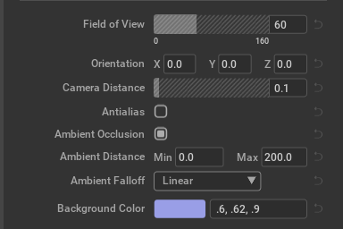
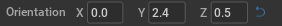
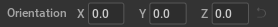
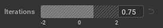
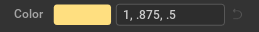
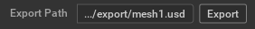

# Overview

In this example, we create a window which uses custom widgets that follow a similar pattern. The window is built using `omni.ui`.

It contains the best practices of how to build customized widgets and reuse them without duplicating the code.  The structure is very similar to that of `omni.example.ui_window`, so we won't duplicate all of that same documentation here.


# Custom Widgets

Because this design had a pattern for most of its attribute rows, like:

`<head><body><tail>`

where "head" is always the same kind of attribute label, the "body" is the customized part of the widget, and then the "tail" is either a revert arrow button, or empty space, we decided it would be useful to make a base class for all of the similar custom widgets, to reduce code duplication, and to make sure that the 3 parts always line up in the UI.



By structuring the base class with 3 main methods for building the 3 sections, child classes can focus on just building the "body" section, by implementing `_build_body()`.  These are the 3 main methods in the base class, and the `_build_fn()` method that puts them all together:

```python
    def _build_head(self):
        # The main attribute label
        ui.Label(
            self.__attr_label,
            name="attribute_name",
            width=ATTR_LABEL_WIDTH
        )

    def _build_body(self):
        # Most custom widgets will override this method,
        # as it is where the meat of the custom widget is
        ui.Spacer()

    def _build_tail(self):
        # In this case, we have a Revert Arrow button
        # at the end of each widget line
        with ui.HStack(width=0):
            ui.Spacer(width=5)
            with ui.VStack(height=0):
                ui.Spacer(height=3)
                self.revert_img = ui.Image(
                    name="revert_arrow",
                    fill_policy=ui.FillPolicy.PRESERVE_ASPECT_FIT,
                    width=12,
                    height=13,
                    enabled=False,
                )
            ui.Spacer(width=5)

        # add call back to revert_img click to restore the default value
        self.revert_img.set_mouse_pressed_fn(
            lambda x, y, b, m: self._restore_default())

    def _build_fn(self):
        # Put all the parts together
        with ui.HStack():
            self._build_head()
            self._build_body()
            self._build_tail()
```

and this is an example of implementing `_build_body()` in a child class:

```python
    def _build_body(self):
        with ui.HStack():
            with ui.VStack():
                ui.Spacer(height=2)
                self.__bool_image = ui.Image(
                    name="checked" if self.__default_val else "unchecked",
                    fill_policy=ui.FillPolicy.PRESERVE_ASPECT_FIT,
                    height=16, width=16, checked=self.__default_val
                )
            ui.Spacer()

        self.__bool_image.set_mouse_pressed_fn(
            lambda x, y, b, m: self._on_value_changed())
```

## Value Changed "Revert" Widget
In this example, almost every attribute row has a widget which indicates whether the value has been changed or not. By default, the revert arrow button is disabled and gray, and when the value has been changed it turns light blue and is enabled. Most of the functionality for this widget lives in the CustomBaseWidget class.

The base class also calls a _restore_value method that needs to be implemented in the child class.  Each child class can handle attribute values differently, so the logic of how to revert back needs to live at that level.  The child class also takes care of enabling the revert button when the value has changed, turning it blue.





## Custom Int/Float Slider


At a high level, this custom widget is just the combination of a `ui.FloatSlider` or `ui.IntSlider` and a `ui.FloatField` or `ui.IntField`.  But there are a few more aspects that make this widget interesting:
- The background of the slider has a diagonal lines texture.  To accomplish that, a tiled image of that texture is placed behind the rest of the widget using a ZStack.  A Slider is placed over top, almost completely transparent.  The background color is transparent and the text is transparent.  The foreground color, called the `secondary_color` is light gray with some transparency to let the texture show through.
- Immediately below the slider is some optional tiny text that denotes the range of the slider. If both min and max are positive or both are negative, only the endpoints are shown.  If the min is negative, and the max is positive, however, the 0 point is also added in between, based on where it would be.  That tiny text is displayed by using `display_range=True` when creating a `CustomSliderWidget`.
- There was a bug with sliders and fields around how the padding worked.  It is fixed and will be available in the next version of Kit, but until then, there was a workaround to make things look right: a ui.Rectangle with the desired border is placed behind a ui.FloatField.  The Field has a transparent background so all that shows up from it is the text.  That way the Slider and Field can line up nicely and the text in the Field can be the same size as with other widgets in the UI.

## Customized ColorWidget
The customized ColorWidget wraps a `ui.ColorWidget` widget and a `ui.StringField` widget in a child class of CustomBaseWidget.



The colorpicker widget is a normal `ui.ColorWidget`, but the text part is really just a `ui.StringField` with comma-separated values, rather than a `ui.MultiFloatDragField` with separate R, G, and B values.  So it wasn't as easy to just use the same model for both.  Instead, to make them connect in both directions, we set up a callback for each widget, so that each would update the other one on any changes:

```python
    self.__color_sub = self.__colorpicker.model.subscribe_item_changed_fn(
        lambda m, _, children=color_model.get_item_children(): self.set_color_stringfield(m, children))
    self.__strfield_sub = self.__strfield.model.subscribe_value_changed_fn(
        lambda m, children=color_model.get_item_children():
            self.set_color_widget(m, children))
```

## Custom Path & Button Widget
The Custom Path & Button widget doesn't follow quite the same pattern as most of the others, because it doesn't have a Revert button at the end, and the Field and Button take different proportions of the space.



In the widget's `_build_fn()` method, we draw the entire row all in one place.  There's the typical label on the left, a StringField in the middle, and a Button at the end:

```python
    with ui.HStack():
        ui.Label(
            self.__attr_label,
            name="attribute_name",
            width=ATTR_LABEL_WIDTH
        )
        self.__pathfield = ui.StringField(
            name="path_field",
            height=BLOCK_HEIGHT,
            width=ui.Fraction(2),
        )
        self.__pathfield.model.set_value(self.__path)

        self.__btn = ui.Button(
            self.__btn_label,
            name="tool_button",
            height=BLOCK_HEIGHT,
            width=ui.Fraction(1),
            clicked_fn=lambda path=self.get_path(): self.__callback(path),
        )
```

All of those strings for labels and paths are customizable when creating the Widget.  In window.py, this is how we instantiate the Export-style version:

_(Note: In a real situation we would use the entire path, but we added the "..." ellipsis to show an ideal way to clip the text in the future.)_

```python
                CustomPathButtonWidget(
                    label="Export Path",
                    path=".../export/mesh1.usd",
                    btn_label="Export",
                    btn_callback=self.on_export_btn_click,
                )
```
And we show a sample callback hooked up to the button -- `self.on_export_btn_click`, which for this example, just pops up a MessageDialog telling the user what the path was that is in the Field:

```python
    def on_export_btn_click(self, path):
        """Sample callback that is used when the Export button is pressed."""
        dialog = MessageDialog(
            title="Button Pressed Dialog",
            message=f"Export Button was clicked with path inside: {path}",
            disable_cancel_button=True,
            ok_handler=lambda dialog: dialog.hide()
        )
        dialog.show()
```

# Style

Although the style can be applied to any widget, we recommend keeping the style
dictionary in one location, such as `styles.py`.

One comment on the organization of the styles.  You may notice named constants that seem redundant, that could be consolidated, such as multiple font type sizes that are all `14`.

```python
fl.window_title_font_size = 18
fl.field_text_font_size = 14
fl.main_label_font_size = 14
fl.multi_attr_label_font_size = 14
fl.radio_group_font_size = 14
fl.collapsable_header_font_size = 13
fl.range_text_size = 10
```

While you definitely _could_ combine all of those into a single constant, it can be useful to break them out by type of label/text, so that if you later decide that you want just the Main Labels to be `15` instead of `14`, you can adjust just the one constant, without having to break out all of the other types of text that were using the same font size by coincidence.  This same organization applies equally well to color assignments also.

# Window

It's handy to derive a custom window from the class `ui.Window`. The UI can be
defined right in `__init__`, so it's created immediately or it can be defined in
a `set_build_fn` callback and it will be created when the window is visible. The later one is used in this example.

```python
class PropertyWindowExample(ui.Window):
    """The class that represents the window"""

    def __init__(self, title: str, delegate=None, **kwargs):
        self.__label_width = LABEL_WIDTH

        super().__init__(title, **kwargs)

        # Apply the style to all the widgets of this window
        self.frame.style = julia_modeler_style
        # Set the function that is called to build widgets when the window is visible
        self.frame.set_build_fn(self._build_fn)
```
Inside the `self._build_fn`, we use the customized widgets to match the design layout for the window.

# Extension

When the extension starts up, we register a new menu item that controls the window and shows the window.

A very important part is using `ui.Workspace.set_show_window_fn` to register the window in `omni.ui`. It will help to save and load the layout of Kit.

```python
ui.Workspace.set_show_window_fn(JuliaModelerExtension.WINDOW_NAME, partial(self.show_window, None))
```

When the extension shuts down, we remove the menu item and deregister the window callback.