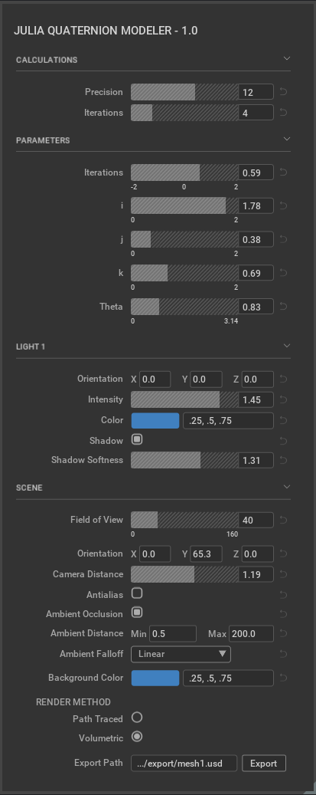

# omni.example.ui_julia_modeler

# Overview

We provide an End-To-End example and general recommendations on creating a
simple window using `omni.ui`.

It contains the best practices of building an extension, a menu item, a window itself, a custom widget, and a generic style.



# Extension

When the extension starts up, we register a new menu item that controls the
window and shows the window.

A very important part is using `ui.Workspace.set_show_window_fn` to register the
window in `omni.ui`. It will help to save and load the layout of Kit.

```python
# The ability to show up the window if the system requires it. We use it
# in QuickLayout.
ui.Workspace.set_show_window_fn(ExampleWindowExtension.WINDOW_NAME, partial(self.show_window, None))
```

When the extension shuts down, we remove the menu item and deregister the window
callback.

# Window

It's handy to derive a custom window from the class `ui.Window`. The UI can be
defined right in \_\_init\_\_, so it's created immediately. Or it can be defined in
a callback and it will be created when the window is visible.

```python
class ExampleWindow(ui.Window):
    """The class that represents the window"""

    def __init__(self, title: str, delegate=None, **kwargs):
        self.__label_width = LABEL_WIDTH

        super().__init__(title, **kwargs)

        # Apply the style to all the widgets of this window
        self.frame.style = example_window_style
        # Set the function that is called to build widgets when the window is
        # visible
        self.frame.set_build_fn(self._build_fn)
```

# Custom Widget

A custom widget can be a class or a function. It's not required to derive
anything. It's only necessary to create sub-widgets.

```python
class ColorWidget:
    """The compound widget for color input"""

    def __init__(self, *args, model=None, **kwargs):
        self.__defaults: List[Union[float, int]] = args
        self.__model: Optional[ui.AbstractItemModel] = kwargs.pop("model", None)

        self.__multifield: Optional[ui.MultiFloatDragField] = None
        self.__colorpicker: Optional[ui.ColorWidget] = None

        self.__frame = ui.Frame()
        with self.__frame:
            self._build_fn()
```

# Style

Although the style can be applied to any widget, we recommend keeping the style
dictionary in one location.

There is an exception to this recommendation. It's recommended to use styles
directly on the widgets to hide a part of the widget. For example, it's OK to
set `{"color": cl.transparent}` on a slider to hide the text. Or
`"background_color": cl.transparent` to disable background on a field.
