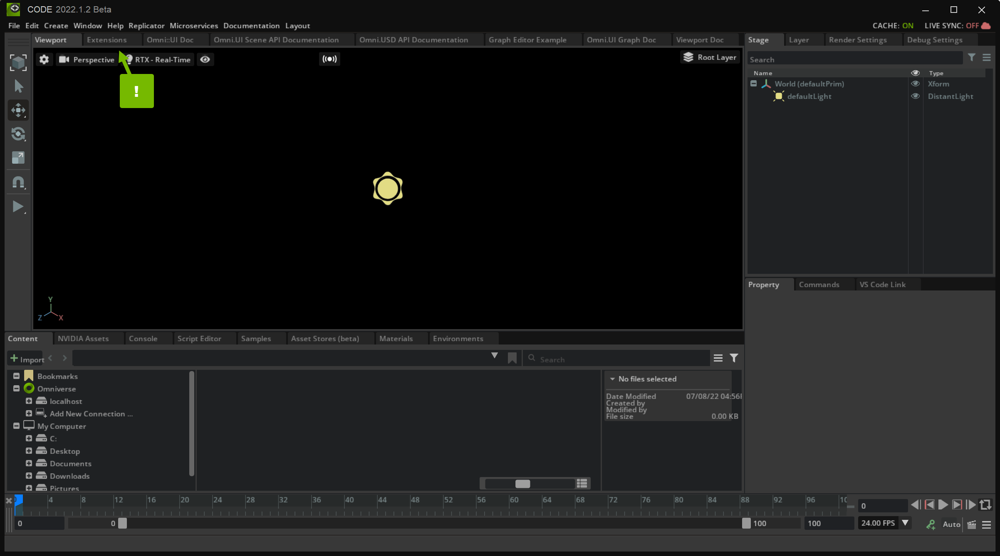
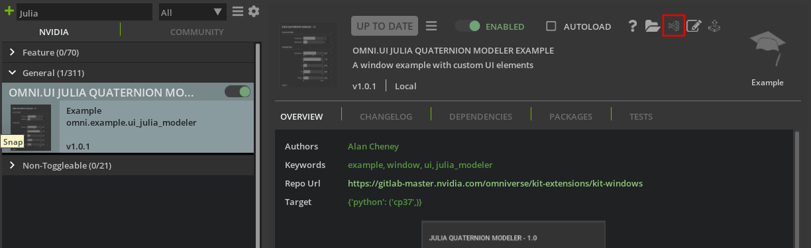

# How to Understand and Navigate Omniverse Code from Other Developers

This tutorial teaches how to access, navigate and understand source code from extensions written by other developers. This is done by opening an extension, navigating to its code and learning how its user interface is put together. It also teaches how custom widgets are organized. With this information developers can find user interface elements in other developers' extensions and re-use or extend them. The extension itself is a UI mockup for a [julia quaternion modeling tool](http://paulbourke.net/fractals/quatjulia/).

## Learning Objectives

- Access Source of Omniverse Extensions
- Understand UI Code Structure
- Re-use Widget Code from Other Developers

## Prerequisites

- [UI Window Tutorial](https://github.com/NVIDIA-Omniverse/kit-extension-sample-ui-window/blob/main/exts/omni.example.ui_window/tutorial/tutorial.md)
- [UI Gradient Tutorial](https://github.com/NVIDIA-Omniverse/kit-extension-sample-ui-window/blob/main/exts/omni.example.ui_gradient_window/tutorial/tutorial.md)
- Omniverse Code version 2022.1.1 or higher
- Working understanding of GitHub
- Visual Studio Code

## Step 1: Clone the Repository

Clone the `main` branch of the `kit-extension-sample-ui-window` [GitHub repository](https://github.com/NVIDIA-Omniverse/kit-extension-sample-ui-window):

```shell
git clone https://github.com/NVIDIA-Omniverse/kit-extension-sample-ui-window.git
```

This repository contains the code you use in this tutorial.

## Step 2: Add the Extension to Omniverse Code

In order to use and test your Extension, you need to add it to Omniverse Code. 

### Step 2.1: Navigate to the Extensions List

In Omniverse Code, navigate to the *Extensions* panel:



Here, you see a list of Omniverse Extensions that you can activate and use in Code.

> **Note:** If you don't see the *Extensions* panel, enable **Window > Extensions**:
>
> 

### Step 2.2: Navigate to the *Extension Search Paths*

Click the **gear** icon to open *Extension Search Paths*:


In this panel, you can add your custom Extension to the Extensions list.

### Step 2.3: Create a New Search Path

Create a new search path to the `exts` directory of your Extension by clicking the green **plus** icon and double-clicking on the **path** field:


When you submit your new search path, you should be able to find your extension in the *Extensions* list. Search for "omni.example.ui_" to filter down the list. Activate the "OMNI.UI JULIA QUATERNION MO..." Extension:


Now that your Extension is added and enabled, you can make changes to the code and see them in your Application. You will see the user interface pictured below:

<p align="center">
    
<p>

## Step 3: View the User Interface and Source Code

### Step 3.1: Review the User Interface

Take a moment to think like a connoisseur of excellent user interface elements. What aspects of this user interface are worth collecting? Notice the styling on the collapsable frames, the backgrounds on the sliders. Edit some of the values and notice that the arrow on the right is now highlighted in blue. Click on that arrow and notice that the slider returns to a default value. Focus on the best aspects because you can collect those and leave the lesser features behind.

### Step 3.2: Access the Source Code

Now, go back to the extensions window and navigate to the `Julia` extension. Along the top of its details window lies a row of icons as pictured below:

<p align="center">
    
<p>

Click on the Visual Studio icon to open the Extension's source in Visual Studio. This is a great way to access extension source code and learn how they were written.

## Step 4: Find `extension.py`

This section explains how to start navigation of an extension's source code.

### Step 4.1: Access the Extension Source Code

Open the Visual Studio window and expand the `exts` folder. The image below will now be visible:

<p align="center">
    
<p>

Click on `omni\example\ui_julia_modeler` to expand it and see the files in that folder as shown below:

<p align="center">
    
<p>

### Step 4.2: Open `extension.py`

The file named `extension.py` is a great place to start. It contains a class that derives from `omni.ext.IExt`.

### Step 4.3: Find the `on_startup` Function

Look for the `on_startup`. This function runs when the extension first starts and is where the UI should be built. It has been included below:

```Python
def on_startup(self):
    # The ability to show the window if the system requires it. We use it
    # in QuickLayout.
    ui.Workspace.set_show_window_fn(JuliaModelerExtension.WINDOW_NAME, partial(self.show_window, None))

    # Add the new menu
    editor_menu = omni.kit.ui.get_editor_menu()
    if editor_menu:
        self._menu = editor_menu.add_item(
            JuliaModelerExtension.MENU_PATH, self.show_window, toggle=True, value=True
        )

    # Show the window. It will call `self.show_window`
    ui.Workspace.show_window(JuliaModelerExtension.WINDOW_NAME)
```

This function does a few steps that are common for a window-based extension. Not all extensions will be written in exactly this way, but these are best practices and are good things to look for.

1. It registers a `show` function with the application.
2. It adds the extension to the `Window` application menu.
3. It requests that the window be shown using the `show` function registered before.

### Step 4.4: Find the Function that Builds the Window

What function has been registered to show the `Julia` extension window? It is `self.show_window()`. Scroll down until you find it in `extension.py`. It has been included below for convenience:

```Python
def show_window(self, menu, value):
    if value:
        self._window = JuliaModelerWindow(
            JuliaModelerExtension.WINDOW_NAME, width=WIN_WIDTH, height=WIN_HEIGHT)
        self._window.set_visibility_changed_fn(self._visiblity_changed_fn)
    elif self._window:
        self._window.visible = False
```

In this function `value` is a boolean that is `True` if the window should be shown and `False` if the window should be hidden. Take a look at the code block that will run if `value` is `True` and you will see that `self._window` is set equal to a class constructor.

### Step 4.5: Navigate to the Window Class

To find out where this class originates, hold the `ctrl` button and click on `JuliaModelerWindow` in the third line of the function. This will navigate to that symbol's definition. In this case it opens the `window.py` file and takes the cursor to definition of the `JuliaModelerWindow` class. The next section explores this class and how the window is built.

## Step 5: Explore `JuliaModelerWindow`

This sections explores the `JuliaModelerWindow` class, continuing the exploration of this extension, navigating the code that builds the UI from the top level towards specific elements.

### Step 5.1: Read `show_window()`

The `show_window()` function in the previous section called the constructor from the `JuliaModelerWindow` class. The constructor in Python is the `__init__()` function and is copied below:

```Python
def __init__(self, title: str, delegate=None, **kwargs):
    self.__label_width = ATTR_LABEL_WIDTH

    super().__init__(title, **kwargs)

    # Apply the style to all the widgets of this window
    self.frame.style = julia_modeler_style
    # Set the function that is called to build widgets when the window is
    # visible
    self.frame.set_build_fn(self._build_fn)
```

The first statement simply sets a label width. The next statement calls `super().__init__()`. This initializes all base classes of `JuliaModelerWindow`. This has to do with inheritance, a topic that will be briefly covered later in this tutorial. The third statement sets the window style, which is useful information, but is the topic of another tutorial. These styles are contained in `style.py` for the curious. Finally, the function registers the `self._build_fn` callback as the frame's build function. This is the function of interest.

### Step 5.2: Navigate to `_build_fn()`

Hold ctrl and click on `self._build_fn` which has been reproduced below:

```Python
def _build_fn(self):
    """
    The method that is called to build all the UI once the window is
    visible.
    """
    with ui.ScrollingFrame(name="window_bg",
                            horizontal_scrollbar_policy=ui.ScrollBarPolicy.SCROLLBAR_ALWAYS_OFF):
        with ui.VStack(height=0):
            self._build_title()
            self._build_calculations()
            self._build_parameters()
            self._build_light_1()
            self._build_scene()
```

This function builds an outer scrolling frame, a vertical stack, and then builds a few sections to add to that stack. Each of these methods has useful information worth taking a look at, but this tutorial will focus on `_build_parameters()`.

### Step 5.3: Navigate to `_build_parameters()`

Navigate to `_build_parameters` using ctrl+click. As usual, it is duplicated below:

```Python
def _build_parameters(self):
    """Build the widgets of the "Parameters" group"""
    with ui.CollapsableFrame("Parameters".upper(), name="group",
                                build_header_fn=self._build_collapsable_header):
        with ui.VStack(height=0, spacing=SPACING):
            ui.Spacer(height=6)

            CustomSliderWidget(min=-2, max=2, display_range=True,
                                label="Iterations", default_val=0.75)

            CustomSliderWidget(min=0, max=2, display_range=True,
                                label="i", default_val=0.65)

            CustomSliderWidget(min=0, max=2, display_range=True,
                                label="j", default_val=0.25)

            CustomSliderWidget(min=0, max=2, display_range=True,
                                label="k", default_val=0.55)

            CustomSliderWidget(min=0, max=3.14, display_range=True,
                                label="Theta", default_val=1.25)
```

Here is a collapsable frame, a vertical stack, and then instead of the horizontal stacks with combinations of labels and controls seen in the `UI_Window` tutorial, there is a list of custom controls. In fact, scrolling up and down the class to look at the other build functions reveals quite a few custom controls. These custom controls are what gives the user interface a variety of controls, maintains a consistent look and feel, and gives them all the same functionality to restore a default value. Taking a closer at constructor for each `CustomSliderWidget` above reveals that each sets a default value for its respective widget.

### Step 5.4: Identify Custom Widgets

In the folder structure are a few files that look like they contain custom widgets, namely:

- `custom_base_widget.py`
- `custom_bool_widget.py`
- `custom_color_widget.py`
- `custom_combobox_widget.py`
- `custom_multifield_widget.py`
- `custom_path_widget.py`
- `custom_radio_widget.py`
- `custom_slider_widget.py`

### Step 5.5: Recognize Hierarchical Class Structure

`custom_base_widget.py` contains `CustomBaseWidget` which many of the other widgets `inherit` from. For example, open one of the widget modules such as `custom_slider_widget.py` and take a look at its class declaration:

```Python
class CustomSliderWidget(CustomBaseWidget):
```

There, in parentheses is `CustomBaseWidget`, confirming that this is a hierarchical class structure with the specific widgets inheriting from `CustomBaseWidget`. For those unfamiliar with inheritance, a quick explanation in the next section is in order.

## Step 6: Inheritance

In Python (and other programming languages) it is possible to group classes together if they have some things in common but are different in other ways and this is called inheritance. With inheritance, a base class is made containing everything in common, and sub-classes are made that contain the specific elements of each object. 2D Shapes are a classic example.

<p align="center">
    
<p>

In this case all shapes have a background color, you can get their area, and you can get their perimeter. Circles, however have a radius where rectangles have a length and a width. When you use inheritance, the common code can be in a single location in the base class where the sub-classes contain the specific code. The next step is to look at `CustomBaseWidget` to see what all of the custom widgets have in common. Either navigate to `custom_base_widget.py` or ctrl+click on `CustomBaseWidget` in any of the sub-classes.

Inheritance is one element of object-oriented programming (OOP). To learn more about OOP, check out [this video](https://www.youtube.com/watch?v=pTB0EiLXUC8). To learn more about inheritance syntax in Python, check out [this article](https://www.w3schools.com/Python/Python_inheritance.asp).

## Step 7: Explore `custom_base_widget.py`

This section explores the code in `custom_base_widget.py`

### Step 7.1: Identify Code Patterns

The developer who wrote this extension has a consistent style, so you should see a lot in common between this class and `JuliaModelerWindow` class. It starts with `__init__()` and `destroy()` functions and further down has a few `_build` functions: `_build_head()`, `_build_body()`, `_build_tail()`, and `_build_fn()`. The `_build_fn()` function is called from the constructor and in turn calls each of the other build functions.

### Step 7.2: Characterize Custom Widget Layout

From this it can be determined that each of the custom widgets has a head, body and tail and if we look at the controls in the UI this makes sense as illustrated below:

<p align="center">
    
<p>

This image shows a vertical stack containing 5 widgets. Each widget is a collection of smaller controls. The first highlighted column contains the head of each widget, the second contains their content and the third holds each tail. This tutorial will now look at how the head, content, and tail are created in turn.

### Step 7.3: Inspect `_build_head()`

`_build_head()` is as follows:

```Python
def _build_head(self):
    """Build the left-most piece of the widget line (label in this case)"""
    ui.Label(
        self.__attr_label,
        name="attribute_name",
        width=ATTR_LABEL_WIDTH
    )
```

It has a single label that displays the text passed into the widget's constructor. This makes sense when looking at the UI, each control has a label and they are all aligned. 

### Step 7.4: Inspect `_build_body()`

`_build_body()` is as follows:

```Python
def _build_body(self):
    """Build the custom part of the widget. Most custom widgets will
    override this method, as it is where the meat of the custom widget is.
    """
    ui.Spacer()
```

In the comments it says that most widgets will override this method. This has to do with the inheritance mentioned before. Just like with `GetArea()` in the shape class, each shape has an area, but that area is calculated differently. In this situation, the function is placed in the base class but each sub-class implements that function in its own way. In this case `_build_body()` is essentially empty, and if you look at each custom widget sub-class, they each have their own `_build_body()` function that runs in place of the one in `CustomBaseWidget`.

### Step 7.5: Inspect `_build_tail()`

Finally, the `_build_tail()` function contains the following code:

```Python
def _build_tail(self):
    """Build the right-most piece of the widget line. In this case,
    we have a Revert Arrow button at the end of each widget line.
    """
    with ui.HStack(width=0):
        ui.Spacer(width=5)
        with ui.VStack(height=0):
            ui.Spacer(height=3)
            self.revert_img = ui.Image(
                name="revert_arrow",
                fill_policy=ui.FillPolicy.PRESERVE_ASPECT_FIT,
                width=12,
                height=13,
                enabled=False,
            )
        ui.Spacer(width=5)

    # call back for revert_img click, to restore the default value
    self.revert_img.set_mouse_pressed_fn(
        lambda x, y, b, m: self._restore_default())
```

This function draws the reverse arrow that lets a user revert a control to a default value and is the same for every custom control. In this way the author of this extension has ensured that all of the custom widgets are well aligned, have a consistent look and feel and don't have the same code repeated in each class. They each implemented their own body, but other than that are the same.

The next section will show how the widget body is implmeneted in the `CustomSliderWidget` class.

## Step 8: Explore `custom_slider_widget.py`

To view the `CustomSliderWidget` class open `custom_slider_widget.py` and take a look at the `build_body()` function which contains the following code:

```Python
def _build_body(self):
    """Main meat of the widget.  Draw the Slider, display range text, Field,
    and set up callbacks to keep them updated.
    """
    with ui.HStack(spacing=0):
        # the user provided a list of default values
        with ui.VStack(spacing=3, width=ui.Fraction(3)):
            with ui.ZStack():
                # Put texture image here, with rounded corners, then make slider
                # bg be fully transparent, and fg be gray and partially transparent
                with ui.Frame(width=SLIDER_WIDTH, height=FIELD_HEIGHT,
                                horizontal_clipping=True):
                    # Spacing is negative because "tileable" texture wasn't
                    # perfectly tileable, so that adds some overlap to line up better.
                    with ui.HStack(spacing=-12):
                        for i in range(50):  # tiling the texture
                            ui.Image(name=TEXTURE_NAME,
                                        fill_policy=ui.FillPolicy.PRESERVE_ASPECT_CROP,
                                        width=50,)

                slider_cls = (
                    ui.FloatSlider if self.__num_type == "float" else ui.IntSlider
                )
                self.__slider = slider_cls(
                    height=FIELD_HEIGHT,
                    min=self.__min, max=self.__max, name="attr_slider"
                )

            if self.__display_range:
                self._build_display_range()

        with ui.VStack(width=ui.Fraction(1)):
            model = self.__slider.model
            model.set_value(self.__default_val)
            field_cls = (
                ui.FloatField if self.__num_type == "float" else ui.IntField
            )

            # Note: This is a hack to allow for text to fill the Field space more, as there was a bug
            # with Field padding.  It is fixed, and will be available in the next release of Kit.
            with ui.ZStack():
                # height=FIELD_HEIGHT-1 to account for the border, so the field isn't
                # slightly taller than the slider
                ui.Rectangle(
                    style_type_name_override="Field",
                    name="attr_field",
                    height=FIELD_HEIGHT - 1
                )
                with ui.HStack(height=0):
                    ui.Spacer(width=2)
                    self.__numberfield = field_cls(
                        model,
                        height=0,
                        style={
                            "background_color": cl.transparent,
                            "border_color": cl.transparent,
                            "padding": 4,
                            "font_size": fl.field_text_font_size,
                        },
                    )
            if self.__display_range:
                ui.Spacer()
```

This function is significantly longer than others in this tutorial and could be overwhelming at first glance. This is the perfect situation to take advantage of code folding. If you hover over the blank column between the line numbers and the code window inside visual studio, downward carrats will appear next to code blocks. Click on the carrats next to the two vertical stacks to collapse those blocks of code and make the function easier to navigate.

<p align="center">
        
<p>

Now it's clear that this function creates an outer horizontal stack which contains two vertical stacks. If you dig deeper you will find that the first vertical stack contains a float slider with an image background. In order to learn how to create an image background like this, check out the [UI Gradient Tutorial](https://github.com/NVIDIA-Omniverse/kit-extension-sample-ui-window/blob/main/exts/omni.example.ui_gradient_window/tutorial/tutorial.md). The second vertical stack contains a number field which displays the number set by the float slider.

If you take a look at the other custom widgets, you will see that each of them has its own `_build_body` function. Exploring these is a great way to get ideas on how to create your own user interface.

## Step 9: Reusing UI code

By exploring extensions in this manner, developers can get a head start creating their own user interfaces. This can range from copying and pasting controls from other extensions, to creating new sub-classes on top of existing base classes, to simply reading and understanding the code written by others to learn from it. Hopefully this tutorial has given you a few tips and tricks as you navigate code written by others.

## Conclusion

This tutorial has explained how to navigate the file and logical structure of a typical Omniverse extension. In addition it has explained how custom widgets work, even when they are part of a hieararchical inheritance structure.
