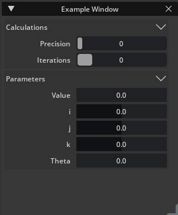

# UI Window Tutorial

This tutorial explains how to create an Omniverse extension that has a window and user interface elements inside that window. By the end of this tutorial you will know how to create an extension that can let the user edit integers, real numbers, booleans, colors and more, all with a consistent look and feel.

## Step 1: Create A Window

In this section you will create an empty window that you can hide and show and is integrated into the application menu. This window will incorporate a few best practices so that it is well connected with omniverse and feel like a natural part of the largest application it is being used from. All of this will be done in the `extension.py` file.

### Step 1.1: Support Hide/Show

Windows can be hidden and shown from outside the window code that you write. If you would like omniverse to be able to show a window after it has been hidden, you must register a function to run when the window visibility changes. To do this, open the `extension.py` file, go to the `on_startup` function, and edit the function to match the following code:

```python
    def on_startup(self):
        # The ability to show the window if the system requires it. 
        # You use it in QuickLayout.
        ui.Workspace.set_show_window_fn(ExampleWindowExtension.WINDOW_NAME, partial(self.show_window, None))

        # Add a Menu Item for the window

        # Show the window through the 'set_show_window_fn' you wired up above
        # It will call `self.show_window`
```

The added line registers the `show_window` function to be run whenever the visibility of your extension is changed. The `pass` line of code is deleted because it is no longer necessary. It was only included because all code had been removed from that function.

### Step 1.2: Add a Menu Item

It is helpful to add extensions to the application menu so that if a user closes a window they can reopen it. This is done by adding the following code to the `on_startup` method:

```python
    def on_startup(self):
        # The ability to show the window if the system requires it. 
        # You use it in QuickLayout.
        ui.Workspace.set_show_window_fn(ExampleWindowExtension.WINDOW_NAME, partial(self.show_window, None))

        # Add a Menu Item for the window
        editor_menu = omni.kit.ui.get_editor_menu()
        if editor_menu:
            self._menu = editor_menu.add_item(
                ExampleWindowExtension.MENU_PATH, self.show_window, toggle=True, value=True
            )

        # Show the window through the 'set_show_window_fn' you wired up above
        # It will call `self.show_window`
```

The first added line grabs a reference to the application menu. The second added line adds a new menu item where `MENU_PATH` determines where the menu item will appear in the menu system, and `show_window` designates the function to run when the user toggles the window visibility by clicking on the menu item.

### Step 1.3: Show the Window

To finish the `on_startup` method add the following:

```python
    def on_startup(self):
        # The ability to show the window if the system requires it. 
        # You use it in QuickLayout.
        ui.Workspace.set_show_window_fn(ExampleWindowExtension.WINDOW_NAME, partial(self.show_window, None))

        # Add a Menu Item for the window
        editor_menu = omni.kit.ui.get_editor_menu()
        if editor_menu:
            self._menu = editor_menu.add_item(
                ExampleWindowExtension.MENU_PATH, self.show_window, toggle=True, value=True
            )

        # Show the window through the 'set_show_window_fn' you wired up above
        # It will call `self.show_window`
        ui.Workspace.show_window(ExampleWindowExtension.WINDOW_NAME)
```

This calls the `show_window` function through the registration you set up earlier.

### Step 1.4: Call the Window Constructor

Finally, in the `extension.py` file, scroll down to the `show_window` routine which is currently the code below:

```python
    def show_window(self, menu, value):
        #value is true if the window should be shown
        if value:
            #call our custom window constructor
            
            #Handles the change in visibility of the window gracefuly
            self._window.set_visibility_changed_fn(self._visiblity_changed_fn)
        elif self._window:
            self._window.visible = False
```

Add the following line to this function:

```python
    def show_window(self, menu, value):
        #value is true if the window should be shown
        if value:
            #call our custom window constructor
            self._window = ExampleWindow(ExampleWindowExtension.WINDOW_NAME, width=300, height=365)

            #Handles the change in visibility of the window gracefuly
            self._window.set_visibility_changed_fn(self._visiblity_changed_fn)
        elif self._window:
            self._window.visible = False
```

This calls the constructor of the custom window class in `window.py` and assigns it to our extensions `_window` property. Doing so will display the custom window from that class within the application.

## Step 2: Enable the Extension

Open Omniverse Create and go to the extension tab. Click on the gear icon next to the search bar and your extension search paths will appear. Scroll to the bottom of the list and click on the green plus. Navigate to the folder where you have this repository cloned and go to the `exts` folder. Copy that folder's path and paste it into the new search path you just added.

Go to the search bar within the extensions tab and search for `ui_window` and click on its toggle to enable this extension. At this point you will see a blank window as shown below:

<p align="center">
        
<p>

As you modify the code in this tutorial, your changes will `Hot Reload`. In other words, when you save, your files will reload on the fly and the window will update to reflect the changes you have made. This feature allows you make changes to your extension and test them in rapid iterations.

## Step 3: Custom Window

The custom window class can be found in `window.py`. It is possible to simply build all of your user interface in `extension.py`, but this is only a good practice for very simple extensions. More complex extensions should broken into managable pieces. It is a good practice to put your user interface into its own file. Note that `window.py` contains a class that inherits from `ui.window`. Change the `__init__` function to include the line added below:

```python
    def __init__(self, title: str, delegate=None, **kwargs):
        self.__label_width = LABEL_WIDTH

        super().__init__(title, **kwargs)

        # Apply the style to all the widgets of this window
        self.frame.style = example_window_style
        # Set the function that is called to build widgets when the window is
        # visible
        self.frame.set_build_fn(self._build_fn)
```

This line registers `_build_fn` to run when the window is visible, which is where you will build the user interface for this tutorial.

### Step 3.1: Create a Scrolling Frame

Now scroll down to `_build_fn` at the bottom of `window.py` and add edit it to match the following:

```python
    def _build_fn(self):
        # The method that is called to build all the UI once the window is visible.
        with ui.ScrollingFrame():
            pass
```

The `with` statement, or context block, is one you will use often. The `with` statement creates the object after it, in this case a `ScrollingFrame`, and disposes of it for you automatically. This is particularly important for user interface elements in order to avoid poor performance due to memory leaks. 

A `ScrollingFrame` is an area within your user interface with a scroll bar. By creating one first, if the user makes the window small, a scrollbar will appear, allowing the user to still access all content in the user interface.

The pass call is included here because a contaxt block must run at least one line of code; you will eventually get rid of it.

### Step 3.2: Create a Vertical Stack

Next edit `_build_fn` replace the `pass` line with the following context block and put a `pass` call inside the new context block as shown below:

```python
    def _build_fn(self):
        # The method that is called to build all the UI once the window is visible.
        with ui.ScrollingFrame():
            with ui.VStack(height=0):
                pass
```

Here you have added a `VStack`, which stacks its children vertically. The first item is at the top and each subsequent item is placed below the previous item as demonstrated in the schematic below:

<p align="center">
        
<p>

This will be used to organize controls into groups where each item will be a group.

### Step 3.3: Break the Construction into Chunks

While it would be possible to create the entire user inteface in this tutorial directly in `_build_fin`, as a user interface gets large it can be unwieldly to have it entirely within one function. In order to demonstrate best practices, this tutorial builds each item in the vertical stack above in its own function. Go ahead and edit your code to match the block below:

```python
    def _build_fn(self):
        # The method that is called to build all the UI once the window is visible.
        with ui.ScrollingFrame():
            with ui.VStack(height=0):
                self._build_calculations()
                self._build_parameters()
                self._build_light_1()
```

Each of these functions: `_build_calculations`, `_build_parameters`, and `_build_light_1` build an item in the vertical stack. Each of those items is a group of well-organized controls made with a consistent look and layout.

If you save `window.py` it will `hot reload`, but will not look any different from before. That is because both `ScrollingFrame` and `VStack` are layout controls. This means that they are meant to organize content within them, not be displayed themselves. A `ScrollingFrame` can show a scroll bar, but only if it has content to be scrolled.

## Step 4: Build Calculations

The first group you will create is the `Calculations group`. In this section `CollapsableFrame`, `HStack`, `Label`, and `IntSlider` will be introduced. Scroll up to the `_build_calculations` which looks like the following block of code:

```python
    def _build_calculations(self):
        # Build the widgets of the "Calculations" group

            # A VStack is a vertical stack and aligns widgets vertically one after the other

                # An HStack is a horizontal stack and aligns widgets horizontally one after the other

                    # A label displays text

                    # An IntSlider lets a user choose an integer by sliding a bar back and forth

                # Pairing a label with a control is a common UI comb

                    # The label makes the purpose of the control clear

                    # You can set the min and max value on an IntSlider
        pass
```

In the remaining sub-sections you will fill this in and create our first group of controls.

### Step 4.1: Create a Collapsable Frame

Edit `_build_calculations` to match the following:

```python
    def _build_calculations(self):
        # Build the widgets of the "Calculations" group
        with ui.CollapsableFrame("Calculations", name="group", build_header_fn=self._build_collapsable_header):
            # A VStack is a vertical stack and aligns widgets vertically one after the other

                # An HStack is a horizontal stack and aligns widgets horizontally one after the other

                    # A label displays text

                    # An IntSlider lets a user choose an integer by sliding a bar back and forth

                # Pairing a label with a control is a common UI comb

                    # The label makes the purpose of the control clear

                    # You can set the min and max value on an IntSlider
            pass
```

A `CollapsableFrame` is a control that you can expand and contract by clicking on its header, which will show or hide its content. The first argument passed into its constructor it's title string. The second argument is its name and the final argument is a reference to the function that builds its header. You can write this function to give the header whatever look you want. At this point if you save `window.py` and then open omniverse code you will see a change in your extension's window. The `CollapsableFrame` will be visible and should look like this:

<p align="center">
        
<p>

Next you will add content inside this collapsable frame.

### Step 4.2: Create a Horizontal Stack

The next three steps demonstrate a very common user interface pattern, which is to have titled controls that are well aligned. A common mistake is to create a user interface that looks like this:

<p align="center">
        
<p>

The controls have description labels, but they are in inconsistent positions and alignments. The following is a better design: 

<p align="center">
        
<p>

Notice that the description labels are all to the left of their respective controls, the labels are aligned, and the controls have a consistent width.

This will be demonstrated twice within a `VSTack` in this section. Add a `VStack` and then to create this common description-control layout, add an `HStack` to the user interface as demonstrated in the following code block:

```python
    def _build_calculations(self):
        # Build the widgets of the "Calculations" group
        with ui.CollapsableFrame("Calculations", name="group", build_header_fn=self._build_collapsable_header):
            # A VStack is a vertical stack and aligns widgets vertically one after the other
            with ui.VStack(height=0, spacing=SPACING):
                # An HStack is a horizontal stack and aligns widgets horizontally one after the other
                with ui.HStack():
                    # A label displays text

                    # An IntSlider allows a user choose an integer by sliding a bar back and forth
                pass

                # Pairing a label with a control is a common UI comb

                    # The label makes the purpose of the control clear

                    # You can set the min and max value on an IntSlider
            pass
```

An `HStack` is very similar to a `VStack` except that it stacks its content horizontally rather than vertically. Note that a pass has been added to the `VSTack` simply so that the code will run until you add more controls to this context.

### Step 4.3: Create a Label

Next add a `Label` to the `HStack` as follows:

```python
    def _build_calculations(self):
        # Build the widgets of the "Calculations" group
        with ui.CollapsableFrame("Calculations", name="group", build_header_fn=self._build_collapsable_header):
            # A VStack is a vertical stack and aligns widgets vertically one after the other
            with ui.VStack(height=0, spacing=SPACING):
                # An HStack is a horizontal stack and aligns widgets horizontally one after the other
                with ui.HStack():
                    # A label displays text
                    ui.Label("Precision", name="attribute_name", width=self.label_width)
                    # An IntSlider allows a user choose an integer by sliding a bar back and forth
                
                # Pairing a label with a control is a common UI comb

                    # The label makes the purpose of the control clear

                    # You can set the min and max value on an IntSlider
```

If you save the file and go to `Code` you will see that the `label` appears in the user interface. Take special note of the `width` attribute passed into the constructor. By making all of the labels the same width inside their respective `HStack` controls, the labels and the controls they describe will be aligned. Note also that all contexts now have code, so you have removed the `pass` statements.

### Step 4.4: Create an IntSlider

Next add an `IntSlider` as shown below:

```python
    def _build_calculations(self):
        # Build the widgets of the "Calculations" group
        with ui.CollapsableFrame("Calculations", name="group", build_header_fn=self._build_collapsable_header):
            # A VStack is a vertical stack and aligns widgets vertically one after the other
            with ui.VStack(height=0, spacing=SPACING):
                # An HStack is a horizontal stack and aligns widgets horizontally one after the other
                with ui.HStack():
                    # A label displays text
                    ui.Label("Precision", name="attribute_name", width=self.label_width)
                    # An IntSlider allows a user choose an integer by sliding a bar back and forth
                    ui.IntSlider(name="attribute_int")
                # Pairing a label with a control is a common UI comb

                    # The label makes the purpose of the control clear

                    # You can set the min and max value on an IntSlider
```

An `IntSlider` is a slider bar that a user can click and drag to control an integer value. If you save your file and go to `Code`, your user interface should now look like this:

<p align="center">
        
<p>

Go ahead and add a second description-control pair by adding the following code: 

```python
    def _build_calculations(self):
        # Build the widgets of the "Calculations" group
        with ui.CollapsableFrame("Calculations", name="group", build_header_fn=self._build_collapsable_header):
            # A VStack is a vertical stack and aligns widgets vertically one after the other
            with ui.VStack(height=0, spacing=SPACING):
                # An HStack is a horizontal stack and aligns widgets horizontally one after the other
                with ui.HStack():
                    # A label displays text
                    ui.Label("Precision", name="attribute_name", width=self.label_width)
                    # An IntSlider allows a user choose an integer by sliding a bar back and forth
                    ui.IntSlider(name="attribute_int")
                # Pairing a label with a control is a common UI comb
                with ui.HStack():
                    # The label makes the purpose of the control clear
                    ui.Label("Iterations", name="attribute_name", width=self.label_width)
                    # You can set the min and max value on an IntSlider
                    ui.IntSlider(name="attribute_int", min=0, max=5)
```

You have added another `HStack`. This one has a `Label` set to the same width as our first `Label`. This gives the group consistent alignment. Min and max values have also been set on the second `IntSlider` as a demonstration. Save `window.py` and experiment with the extension in `Code`. Expand and collapse the `CollapsableFrame`, resize the window and change the integer values. It is a good practice to move and resize your extension windows as you code to make sure that the layout looks good no matter how the user resizes it.

## Step 5: Build Parameters

In this section you will introduce the `FloatSlider` and demonstrate how to keep the UI consistent across multiple groups. You will be working in the `_build_parameters` function which starts as shown below: 

```python
    def _build_parameters(self):
        # Build the widgets of the "Parameters" group

                    # A Float Slider is similar to an Int Slider
                    # controls a 'float' which is a number with a decimal point (A Real number)

                    # You can set the min and max of a float slider as well

                # Setting the labels all to the same width gives the UI a nice alignment

                # A few more examples of float sliders

        pass
```

Hopefullly this is starting to feel a bit more familiar. You have an empty function that has a `pass` command at the end as a placeholder until you have added code to all of our contexts.

### Step 5.1: Create a FloatSlider

A `FloatSlider` is very similar to an IntSlider. This difference is that it controls a Real number rather than an Integer. Match the code below to add one to your extension:

```python
    def _build_parameters(self):
        # Build the widgets of the "Parameters" group
        with ui.CollapsableFrame("Parameters", name="group", build_header_fn=self._build_collapsable_header):
            with ui.VStack(height=0, spacing=SPACING):
                with ui.HStack():
                    ui.Label("Value", name="attribute_name", width=self.label_width)
                    # A Float Slider is similar to an Int Slider
                    # controls a 'float' which is a number with a decimal point (A Real number)
                    ui.FloatSlider(name="attribute_float")
                    # You can set the min and max of a float slider as well

                # Setting the labels all to the same width gives the UI a nice alignment

                # A few more examples of float sliders
```

Here you have added a second `CollapsableFrame` with a `VStack` inside of it. this will allow us to add as many description-control pairs as you want to this group. Note that the `Label` has the same width as the label above. Save `window.py` and you should see the following in `Code`:

<p align="center">
        
<p>

Note that the description labels and controls in the first and second group are aligned with each other.

### Step 5.2: Make a Consistent UI

By using these description control pairs inside of collapsable groups, you can add many controls to a window while maintaining a clean, easy to navigate experience. The following code adds a few more `FloatSlider` controls to the user interface:

```python
    def _build_parameters(self):
        # Build the widgets of the "Parameters" group
        with ui.CollapsableFrame("Parameters", name="group", build_header_fn=self._build_collapsable_header):
            with ui.VStack(height=0, spacing=SPACING):
                with ui.HStack():
                    ui.Label("Value", name="attribute_name", width=self.label_width)
                    # A Float Slider is similar to an Int Slider
                    # controls a 'float' which is a number with a decimal point (A Real number)
                    ui.FloatSlider(name="attribute_float")
                with ui.HStack():
                    ui.Label("i", name="attribute_name", width=self.label_width)
                    # You can set the min and max of a float slider as well
                    ui.FloatSlider(name="attribute_float", min=-1, max=1)
                # Setting the labels all to the same width gives the UI a nice alignment
                with ui.HStack():
                    ui.Label("j", name="attribute_name", width=self.label_width)
                    ui.FloatSlider(name="attribute_float", min=-1, max=1)
                # A few more examples of float sliders
                with ui.HStack():
                    ui.Label("k", name="attribute_name", width=self.label_width)
                    ui.FloatSlider(name="attribute_float", min=-1, max=1)

                with ui.HStack():
                    ui.Label("Theta", name="attribute_name", width=self.label_width)
                    ui.FloatSlider(name="attribute_float")
```

Save `window.py` and take a look in `Code`. Your window should look like this:

<p align="center">
        
<p>

Note that a few of the sliders have min and max values and they they are all well-aligned.

## Step 6: Build Light

In our final group you will add a few other control types to help give you a feel for what can be done in an extension UI. This will also be well arranged, even though they are different control types to give the overall extension a consistent look and feel, even though it has a variety of control types. You will be working in the `_build_light_1` function which starts as shown below:

```python
    def _build_light_1(self):
        # Build the widgets of the "Light 1" group

                    # A multi float drag field allows you control a group of floats (Real numbers)

                # Notice what you use the same label width in all of the collapsable frames
                #   This ensures that the entire UI has a consistent feel

                #Feel free to copy this color widget and use it in your own UIs

                    # The custom compound widget

                #An example of a checkbox
        pass
```

First you will add a `MultiFloatDragField` to it, then a custom color picker widget and finally a `Checkbox`.

### Step 6.1: Create a MultiFloatDragField

Edit `_build_light_1` to match the following:

```python
    def _build_light_1(self):
        # Build the widgets of the "Light 1" group
        with ui.CollapsableFrame("Light 1", name="group", build_header_fn=self._build_collapsable_header):
            with ui.VStack(height=0, spacing=SPACING):
                with ui.HStack():
                    ui.Label("Orientation", name="attribute_name", width=self.label_width)
                    # A multi float drag field allows you control a group of floats (Real numbers)
                    ui.MultiFloatDragField(0.0, 0.0, 0.0, h_spacing=SPACING, name="attribute_vector")

                # Notice what you use the same label width in all of the collapsable frames
                #   This ensures that the entire UI has a consistent feel
                with ui.HStack():
                    ui.Label("Intensity", name="attribute_name", width=self.label_width)
                    ui.FloatSlider(name="attribute_float")

                #Feel free to copy this color widget and use it in your own UIs

                    # The custom compound widget

                #An example of a checkbox
```

This adds a third, `CollapsableFrame` with a `VStack` to hold its controls. Then it adds a description-control pair with a `MultiFloatDragField`. A `MultiFloatDragField` lets a user edit as many values as you put into its constructor, and is commonly used to edit 3-component vectors such as position and rotation.

You have also added a second description-control pair with a `FloatSlider` similar to the one added in [section 5.1](#51-create-a-floatslider).

### Step 6.2: Add a Custom Widget

Developers can create custom widgets and user interface elements. The color picker added in this section is just such an example. Add it to your extension with the following code:

```python
    def _build_light_1(self):
        # Build the widgets of the "Light 1" group
        with ui.CollapsableFrame("Light 1", name="group", build_header_fn=self._build_collapsable_header):
            with ui.VStack(height=0, spacing=SPACING):
                with ui.HStack():
                    ui.Label("Orientation", name="attribute_name", width=self.label_width)
                    # A multi float drag field lets you control a group of floats (Real numbers)
                    ui.MultiFloatDragField(0.0, 0.0, 0.0, h_spacing=SPACING, name="attribute_vector")

                # Notice what you use the same label width in all of the collapsable frames
                #   This ensures that the entire UI has a consistent feel
                with ui.HStack():
                    ui.Label("Intensity", name="attribute_name", width=self.label_width)
                    ui.FloatSlider(name="attribute_float")

                #Feel free to copy this color widget and use it in your own UIs
                with ui.HStack():
                    ui.Label("Color", name="attribute_name", width=self.label_width)
                    # The custom compound widget
                    ColorWidget(0.25, 0.5, 0.75)

                #An example of a checkbox
```

This widget lets users click and then select a color. Feel free to use this widget in your own applications and feel free to write and share your own widgets. Over time you will have a wide variety of useful widgets and controls for everyone to use in their extensions.

### Step 6.3: Add a Checkbox

Finally, edit your _build_light_1 function to match the following: 

```python
    def _build_light_1(self):
        # Build the widgets of the "Light 1" group
        with ui.CollapsableFrame("Light 1", name="group", build_header_fn=self._build_collapsable_header):
            with ui.VStack(height=0, spacing=SPACING):
                with ui.HStack():
                    ui.Label("Orientation", name="attribute_name", width=self.label_width)
                    # A multi float drag field lets you control a group of floats (Real numbers)
                    ui.MultiFloatDragField(0.0, 0.0, 0.0, h_spacing=SPACING, name="attribute_vector")

                # Notice what you use the same label width in all of the collapsable frames
                #   This ensures that the entire UI has a consistent feel
                with ui.HStack():
                    ui.Label("Intensity", name="attribute_name", width=self.label_width)
                    ui.FloatSlider(name="attribute_float")

                #Feel free to copy this color widget and use it in your own UIs
                with ui.HStack():
                    ui.Label("Color", name="attribute_name", width=self.label_width)
                    # The custom compound widget
                    ColorWidget(0.25, 0.5, 0.75)

                #An example of a checkbox
                with ui.HStack():
                    ui.Label("Shadow", name="attribute_name", width=self.label_width)
                    ui.CheckBox(name="attribute_bool")
```

This adds a description-control pair with a `CheckBox`. A `CheckBox` control allows a user to set a boolean value.

Save your `window.py` file and open `Code`. Your user interface should look like this if you collapse the `parameters` section:

<p align="center">
        
<p>

There are three collapsable groups, each with a variety of controls with a variety of settings and yet they are all well-aligned with a consistent look and feel.

## Step 7: Conclusions

In this tutorial you have created an extension user interface using coding best practices to integrate it into an Omniverse application. It contains a variety of controls that edit Integers, Real numbers, colors and more. These controls are well organized so that a user can easily find their way around the window.

You look forward to seeing the excellent extensions you come up with and how you can help omniverse users accomplish things that were hard or even impossible to do before you wrote an extension to help them.
